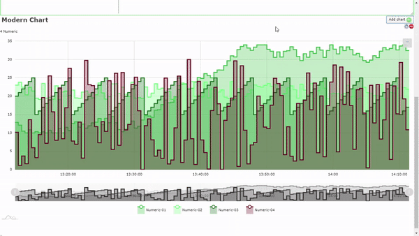
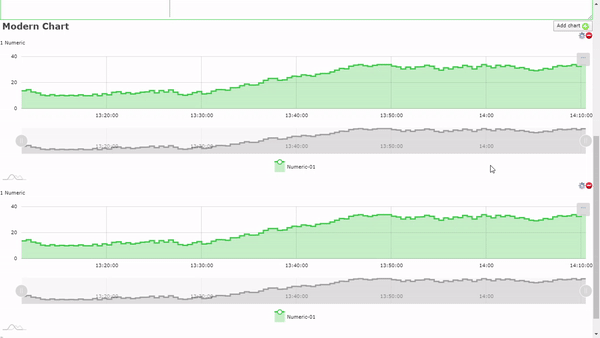

# Modern Charts Components
## February 2020 - Version 1.0.2 
WebSCADA modern charts components it is a set of new VueJS v2.0 components designed for GraphicalView in WebSCADA. It is based on [am4chart](https://www.amcharts.com/) library. It generates charts using JavaScript from user-side which is a new approach to charts in Scada (they were generated via server-side scripts and libraries). It is more browser load than it was before, but server application becomes lighter and gains performance. 

## Types of charts:
- __\<line-chart>__ Line Series Chart
- __\<step-line-chart>__ Step Line Series Chart

## Usage:
New charts could be added to WebSCADA Graphical View by adding a new HTML component with specific content. Each chart has to be initialized by using this listed above Extended HTML Tags. Each of this tag take a specific properties required to set up specific chart. Chart is generated inside this tag which has default size 750x500px.
***
### Quick start:
Create simple line chart for specific [ numeric | multistate | binary ] data point. 
```
<div id="chart-line-0" point-id="[dataPointID]"/>
```

or

```
<div id="chart-line-0" point-xid="[dataPointExportID]"/>
```

That's it!\
It has rendered line chart for specific point from last hour with default parameters. So if you want to monitor the state of the point from last hour it is the simplest way how to do it. This chart could be zoomed in and out using scrollbar at the bottom of the component. Values of data point in time are represented by white dots on the chart.

But it is still just a chart like this old ones... What if we really want to monitor status of this point __in real-time__? No problem just add next properties. 
***
### Live Data
```
<div id="chart-line-0" point-id="[dataPointID]" refresh-rate="10000"/>
```
__Now we've got live chart!__\
It is refreshed every 10s (10000 ms) and when a data point will change state to different value this new one will be added to chart and the oldest one will be deleted from out chart. Now we can monitor state of datapoint in real-time with chosen by us refresh rate. For critical data, we can monitor the status of the point with a high frequency of queries to server (more real-time data but more resource consuming) and for non-critical data we can refresh chart after a few seconds. 

But what if we want to display chart for __multiple data points?__
***
### Multiple points
Just add next data point after comma in _'point-id'_ property. 
```
<div id="chart-step-line-0" point-id="[dataPointID],[anotherDataPointID],[andNextDataPointID"],[fourthDataPointID"]/>
```

Now we have chart for 3 data points with values from last 1 hour. This components do not have limitations for a count of points displayed on the one chart, but I hope that you have an intuition that 30 point on a single chart is not a wise move.  

Can we display __older values__ than last one hour?
***
### Specified time period
Yes! Just add a new property to our tag.
```
<div id="chart-line-0" point-xid="[dataPointExportID]" refresh-rate="10000" start-date="1-day"/>
```
As you can see it's a piece of cake. Just type inside 'start-date' property, time period from which you want to see the data. You can use a every combination of numbers with specific time period __[ hour(s) | day(s) | weak(s) | month(s) ]__. (eg. '2-days', '1-week', '3-months' etc.) But it is not everything! It is dynamic calculated time from now but we can also use a specific date. If we want see data from beginning of the previous year just type in date _(eg. '2019/02/01' to see data beginning  from 1-st February 2019)_. It could be useful to limit displayed data. 

To display values from specified period just add __'end-date'__ parameter. 
```
<div id="chart-line-0" point-xid="[dataPointExportID]" start-date="2019/02/01" end-date="2019/03/01"/>
```
And it still works with multiple data points. It's great! Isn't it? \
But what if I want to add a horizontal line to chart to create for example warning level, which of it is exceeded it could be dangerous? 
***
### Level range line
Ok let's consider this one:
```
<div id="chart-line-0" point-id="[dataPointID]" range-value="100" range-color="#FF0000" range-label="boiling"/>
```
Now we have created horizontal line for our chart which indicates boiling level for water. Thanks to that we can quickly observe that temperature of water inside tank is boiling. It is useful  even inside WebSCADA.

Wait a moment! We decided which color this horizontal line would have. Could we do the same with chart lines? 
***
### Chart Colors
For example we have got 3 sensors. This default green colors are too similar. Can we set up a different color set for our charts. Just add this parameter: 
```
<div id="chart-line-0" point-id="[dpID],[dpID_2],[dpID_3]" color="#FFFC19, #0971B3, #B31212"/>
```
Now we have got defined 3 custom colors for our charts. We can give just a one color value and the rest will be retrieved from this default values. What is the most important... __USE HEXADECIMAL COLOR CODE VALUES__\
Pretty colorful Modern Charts. But we still have the same size for them... Yes, yes it also could be changed. 
***
### Chart Size
```
<div id="chart-step-line-0" point-id="[dpID]" width="1080" height="720"/>
```
HD Chart? Why not! Values for attributes are given in Pixels (px). That is useful when we have defined a multiple chart instances on one GraphicalView. We can easily calculate the position of the next chart. 

### Labels
```
<div id="chart-step-line-0" point-id="[dpID]" label="Mid season temperature"/>
```

That would be enough from the basics... It is time for more complex tasks.
***
### Multiple charts
To generate multiple charts on View page just use unique identifiers. 
```
<div id="chart-step-line-0" point-id="[dpID]" label="Outdoor temperature"/>

<div id="chart-step-line-1" point-id="[dpID]" label="Outdoor humidity"/>

<div id="chart-step-line-2" point-id="[dpID]" label="Indoor pressure"/>
```


## Modern Chart documentation:
Available properties in one place for all chart types. Charts _(excluding Gauge Charts)_ could be exported to external file in graphical or text way. You can export to *.png, *.jpg, *.csv, *.json files. 

Properties properties for Step Line, Line charts 
- point-id
- point-xid
- label
- width
- height
- color
- start-date
- end-date
- refresh-rate
- polyline-step
- range-value
- range-color
- range-label
- show-scrollbar-x
- show-scrollbar-y
- show-legned

# Author

- [Radosław Jajko](https://github.com/radek2s): __rjajko@softq.pl__

### Notes:
 More image examples can be find here:

[Watch List Example Images](../../assets/doc/watch_list/)